<div align="center">

# Info2Action

**信息的尽头，应该是行动**

跨平台聚合 · 跨源事件去重 · AI 精选 · 信息→行动闭环

[](LICENSE)


[](#-contributing)

**中文** · [English](docs/README.en.md)

[核心能力](#-核心能力) · [能力全景](#-能力全景) · [架构](#-架构) · [Quick Start](#-quick-start) · [自部署](#-self-hosting) · [Community](#-community)

<br>

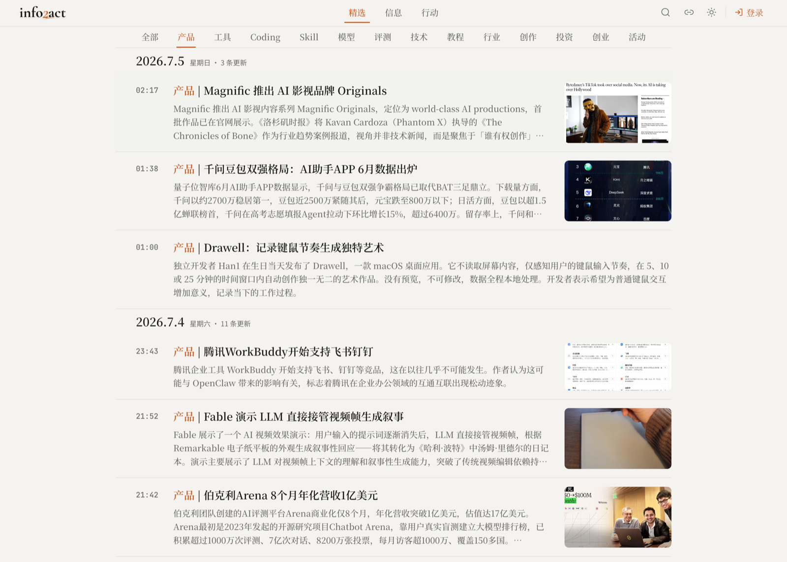

<sub>精选页：世界把同一件事说了十遍，这里只留一条——AI 综述好的事件，沿时间线排开</sub>

</div>

---

信息从没有这么多过，也从没有这么重复过。同一件 AI 大事，会在你的各个信息源里换着标题出现五遍、十遍——你怕错过它，又厌倦重逢它。真正消耗人的从来不是「信息太多」，而是**在重复里打捞增量，在焦虑里空手而归**。

**Info2Action 想把这件事翻过来**：让 AI 先替你读完全部喧嚣——预读、分类、评分，把散落各处的报道折叠成一条事件——然后只把两样东西交还给你：**值得知道的，和值得去做的**。值得做的那部分，会被翻译成「打开哪个链接 / 写哪条评论 / 派发哪个任务」级别的可执行行动。

> 做它，是因为我自己每天早上都被 FOMO 逼着读一堆 AI 新闻——X、公众号、各种源。读本身就很耗神：每篇是好是坏，都得花上一两分钟、动一次脑子才判断得出来。可读完还不算完——还要接着想「这条对我到底有什么用」，再把需求讲清楚、交给 Claude Code 或 Codex 去执行，又是一轮注意力和表达。跨好几个 App、好几段流程，耗掉我大量的注意力和表达力，一条信息才算真正为我所用。这个过程对我来说太痛苦了，所以我想把它自动化：**让信息直接流向行动**。而如果最后那个行动对我没价值，那就不是要不要做的问题，而是我该去优化整条链路的问题。

**对开发者**：这是一套完整的「多源采集 → LLM 增强 → embedding 召回 + LLM 精判聚类 → 精选评分 → 行动派发」全栈 pipeline 实现。FastAPI + React，SQLite 单机可跑，Supabase 可上多用户生产，**prompt 全部开源可改**——这个产品的品味一半藏在 prompt 里，欢迎改成你自己的。

## ✨ 核心能力

<table>
  <tr>
    <td width="50%">
      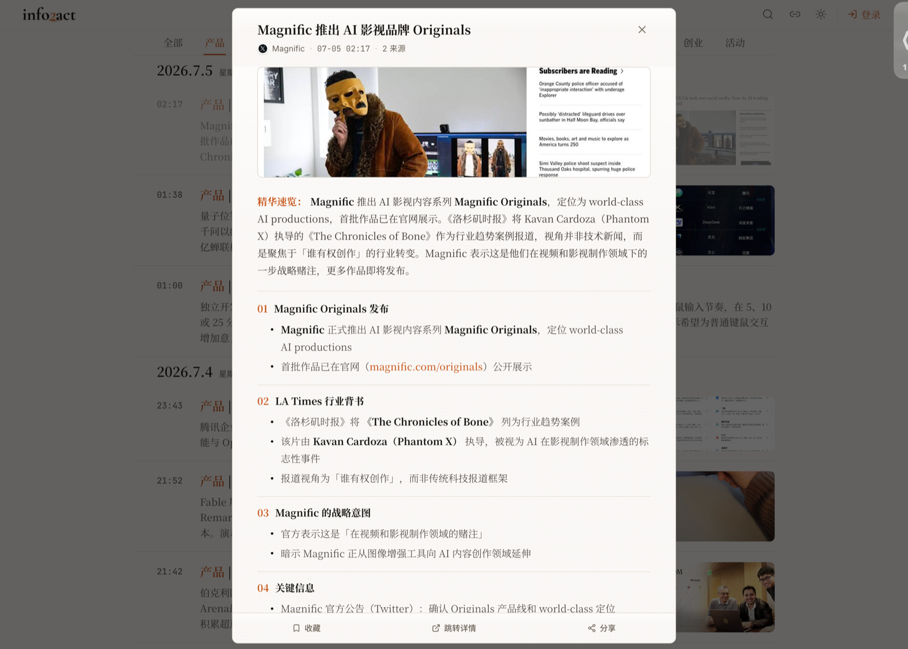
      <p align="center"><sub><b>事件详情</b> — AI 综述 + 结构化要点 + 多源出处，一条事件读完多个平台的报道</sub></p>
    </td>
    <td width="50%">
      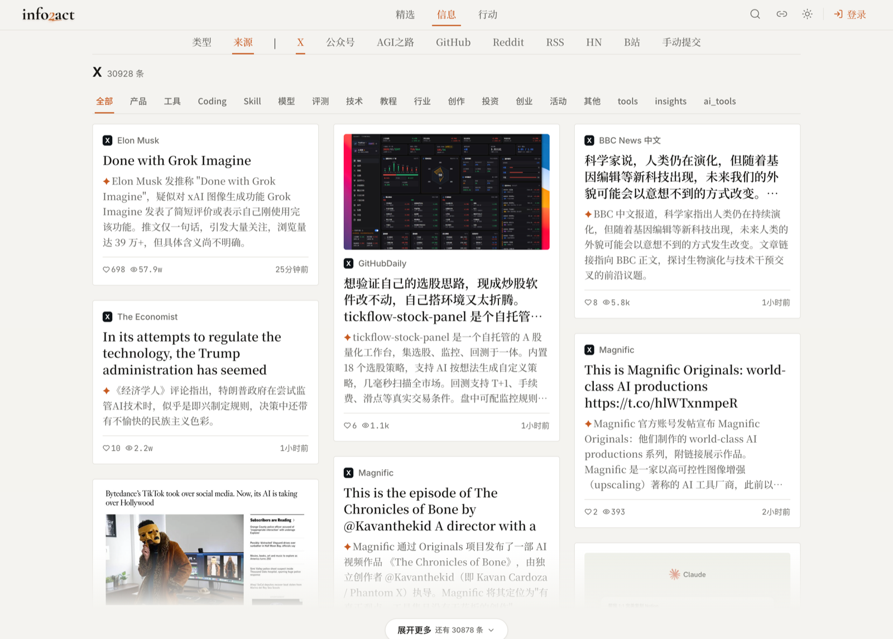
      <p align="center"><sub><b>信息流</b> — 全部来源按内容分类归拢：产品 / 工具 / Coding / 模型 / 行业……</sub></p>
    </td>
  </tr>
  <tr>
    <td width="50%">
      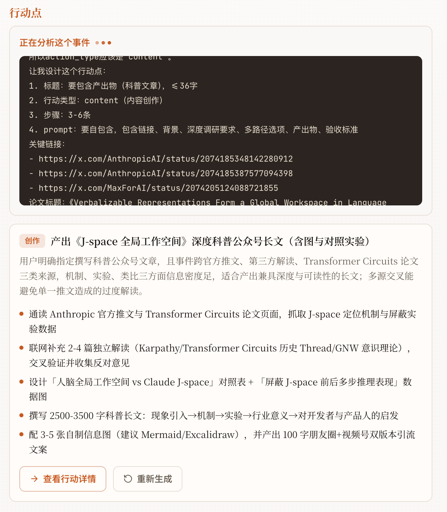
      <p align="center"><sub><b>行动生成</b> — 一键把事件变成可执行行动卡，AI 拆解步骤并产出自包含 prompt，复制即可交给 Claude Code / Codex 执行</sub></p>
    </td>
    <td width="50%">
      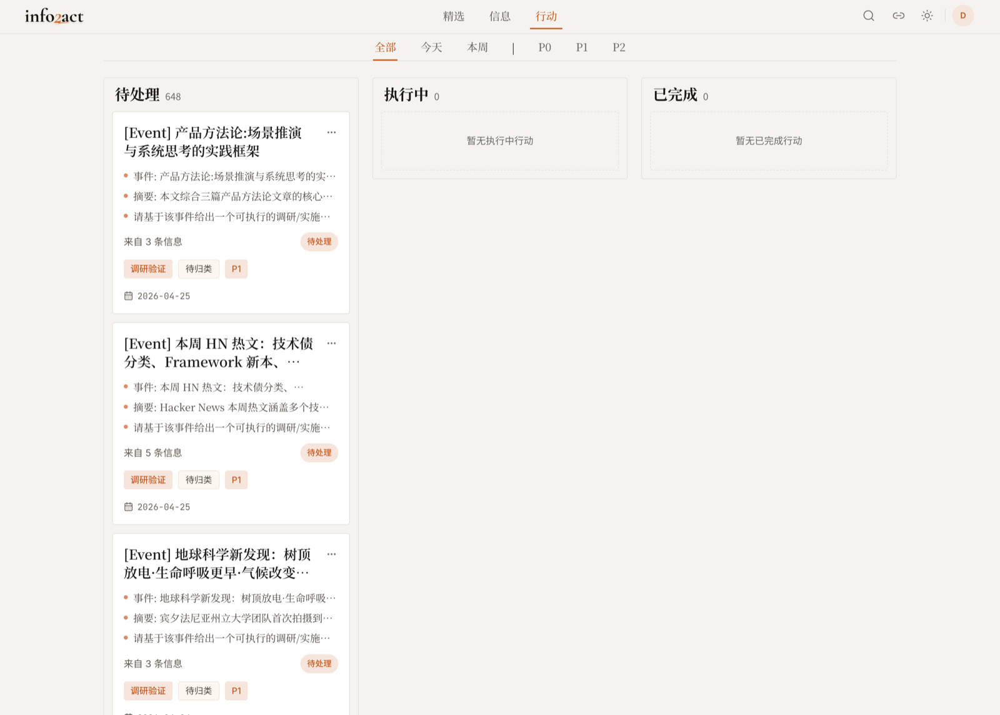
      <p align="center"><sub><b>行动队列</b> — 值得做的信号变成行动卡，待处理 / 执行中 / 已完成三条泳道管理</sub></p>
    </td>
  </tr>
  <tr>
    <td width="50%">
      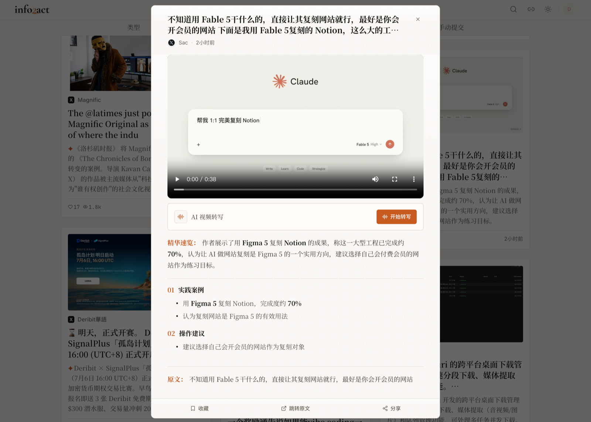
      <p align="center"><sub><b>视频理解</b> — 弹窗内直接播放视频，一键 AI 转写生成双语字幕和要点</sub></p>
    </td>
    <td width="50%">
      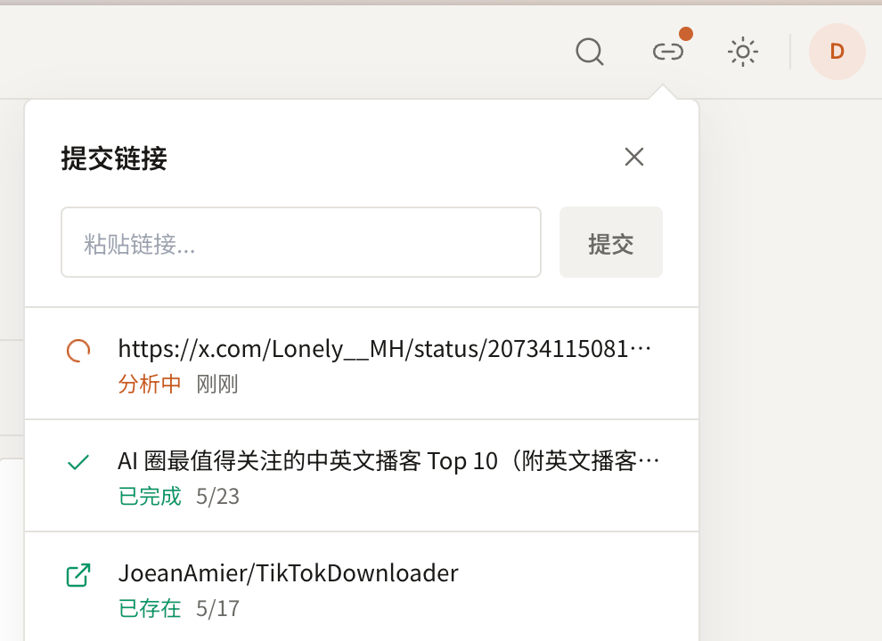
      <p align="center"><sub><b>手动投喂</b> — 粘贴任意链接，AI 抓取并分析入流</sub></p>
    </td>
  </tr>
  <tr>
    <td width="50%">
      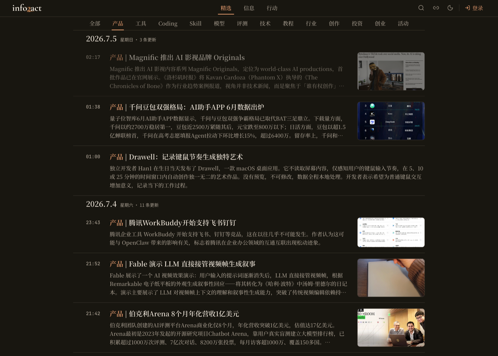
      <p align="center"><sub><b>暗色模式</b> — 全站双主题，跟随系统或手动切换</sub></p>
    </td>
    <td width="50%">
      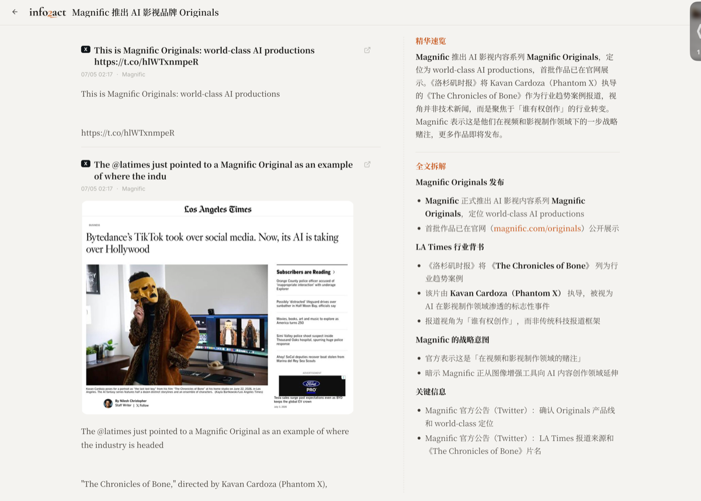
      <p align="center"><sub><b>事件落地页</b> — 每条事件都有独立可分享页面，综述、要点、多源出处一屏读完</sub></p>
    </td>
  </tr>
</table>

<details>
<summary><b>🖼 更多界面</b>（收藏 / 历史 / 设置 / 登录）</summary>
<br>

| | |
|---|---|
| 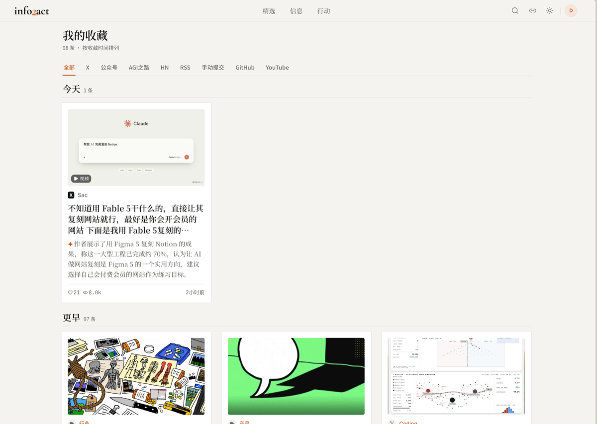 | 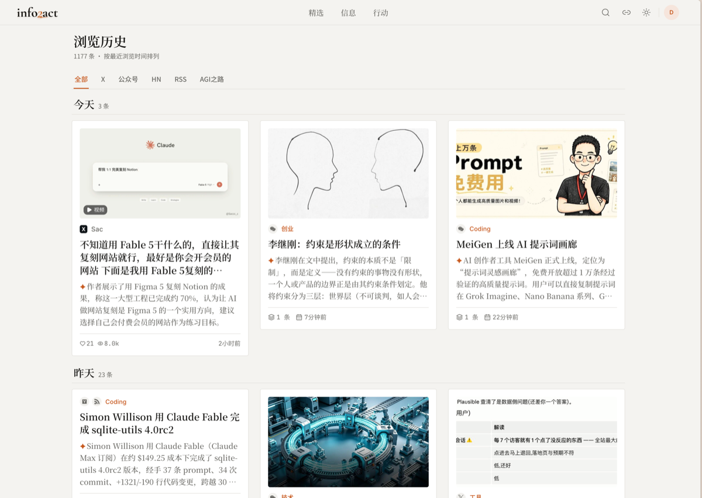 |
| 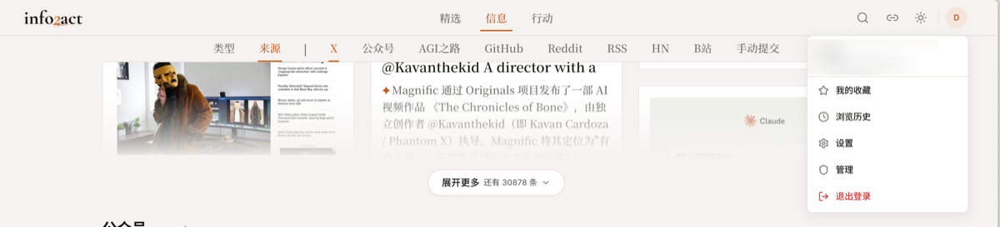 | 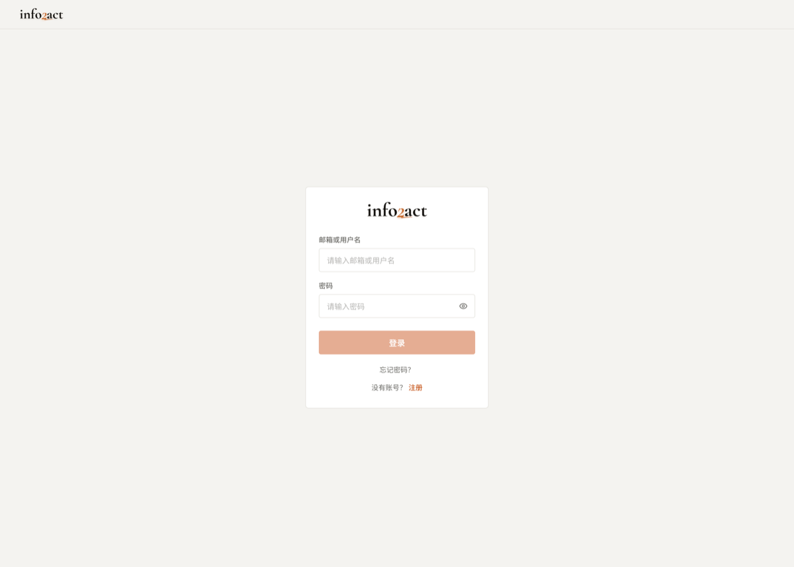 |

</details>

## 🛠 管理后台：给策展算法装上仪表盘

内容 pipeline 不是黑盒——管理面板把「系统健不健康、抓了什么、AI 怎么判的、为什么没展示」全部摊开，并支持人工纠偏回喂算法：

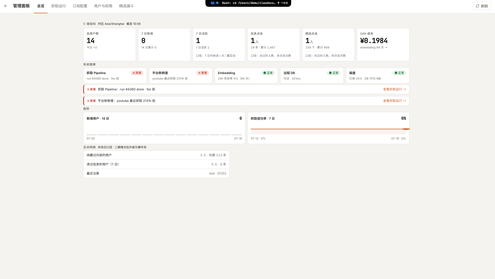
<p align="center"><sub><b>总览仪表盘</b> — 用户规模与互动指标、系统健康 5 信号红绿灯、LLM 成本摘要与趋势 sparkline，一屏回答「系统健康吗？有人在用吗？」</sub></p>

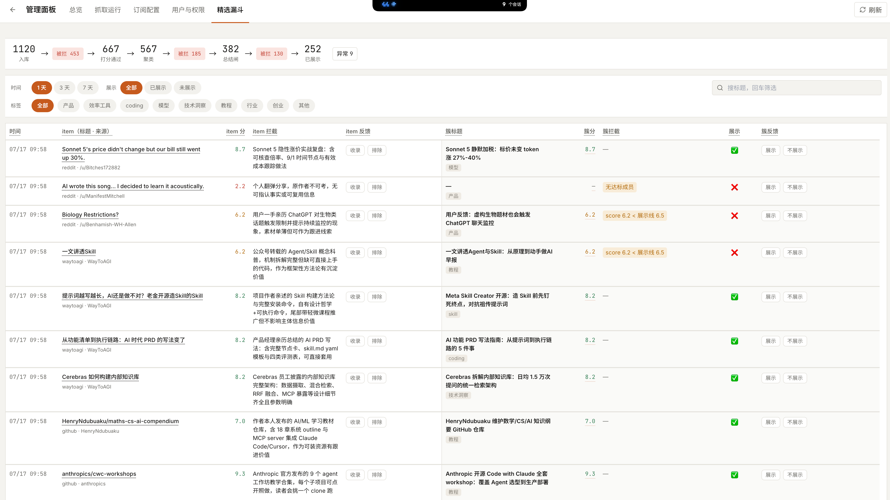
<p align="center"><sub><b>精选漏斗全景表</b> — 入库 → 打分 → 聚类 → 总结闸 → 展示的 5 站漏斗计数条 + 单表归因：每行是一个事件簇，成员条目的 AI 评分与拦截原因全平铺，被拦 / 通过 / 处理中同表可见；支持时间窗 / 内容标签 / 展示状态筛选（标签与漏斗计数联动）。发现误判可原地纠偏——簇级「展示 / 不展示」强制上下架精选页并自动记入金标回放集，条目级「收录 / 排除」精准标注 AI 错杀，反馈直接变成打分策略迭代的回归考卷</sub></p>

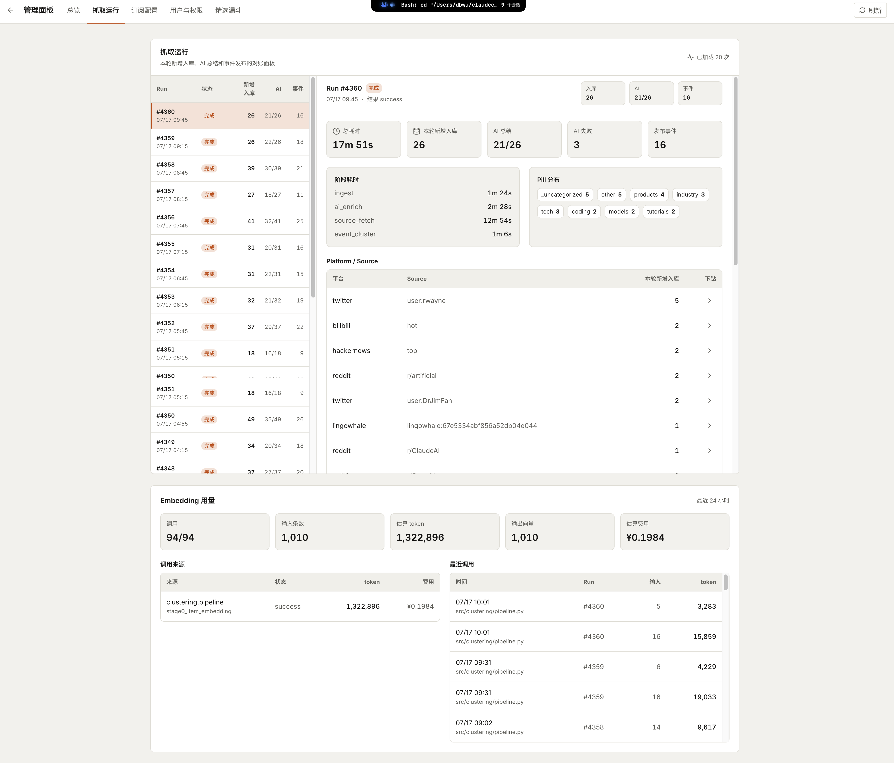
<p align="center"><sub><b>抓取运行对账</b> — 每轮抓取一条 Run 记录：新增入库 / AI 总结成功率 / 发布事件数三段对账，阶段耗时拆解（抓取 / AI 增强 / 聚类），分类分布与逐源下钻，信源掉线一眼可查</sub></p>

## 🧭 能力全景

没有一项是为了演示而做的——每一项都来自「自己每天要用」的真实需要：

<table>
  <thead>
    <tr><th width="150" align="left">能力</th><th align="left">简介</th></tr>
  </thead>
  <tbody>
    <tr>
      <td width="150"><b>多源统一采集</b></td>
      <td>X/Twitter · Reddit · Hacker News · RSS · B 站 · 微信公众号 · GitHub（Trending / Release / 仓库追踪）· YouTube · 小红书 · 手动提交，cron 定时自动跑</td>
    </tr>
    <tr>
      <td width="150"><b>AI 预读增强</b></td>
      <td>LLM 一次性产出摘要、要点、内容分类、内容类型、质量分、关键词；prompt 可读可改（<a href="prompts/"><code>prompts/</code></a>）</td>
    </tr>
    <tr>
      <td width="150"><b>跨源事件聚合</b></td>
      <td>两阶段聚类：embedding 粗召回 + LLM 精判「同一事件」；事件级综述重喂原文生成，聚合过程可审计</td>
    </tr>
    <tr>
      <td width="150"><b>AI 精选</b></td>
      <td>item 级 LLM verdict（featured / borderline / drop）+ cluster 级聚合，直出「应该立即看到的高价值内容」时间线</td>
    </tr>
    <tr>
      <td width="150"><b>个性化排序</b></td>
      <td>注册 onboarding 画像（角色 / 关注方向 / 常用工具），<code>quality × engagement × freshness × match</code> 纯计算排序，不额外烧 LLM</td>
    </tr>
    <tr>
      <td width="150"><b>信息→行动闭环</b></td>
      <td>LLM 把「值得做的信号」翻译成可执行行动卡，支持 Discord Forum 派发或浏览器直跳</td>
    </tr>
    <tr>
      <td width="150"><b>视频理解</b></td>
      <td>YouTube / Twitter / B 站视频字幕优先 + 豆包 ASR 兜底，segment 级双语字幕</td>
    </tr>
    <tr>
      <td width="150"><b>多用户</b></td>
      <td>开放浏览（不登录可读）+ 邀请注册 + 邮箱验证，登录解锁个性化 / 收藏 / 历史 / 行动</td>
    </tr>
    <tr>
      <td width="150"><b>双存储模式</b></td>
      <td>本地 SQLite 单机全功能；Supabase Postgres + Storage 承载多用户生产（远程 read model + pgvector 召回）</td>
    </tr>
  </tbody>
</table>

## 🏗 架构

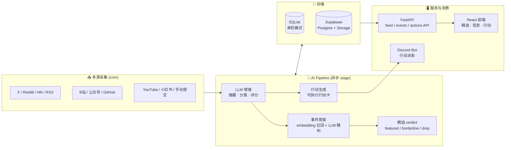
```mermaid
flowchart LR
    subgraph sources["📥 多源采集 (cron)"]
        direction TB
        S1["X / Reddit / HN / RSS"]
        S2["B站 / 公众号 / GitHub"]
        S3["YouTube / 小红书 / 手动提交"]
    end

    subgraph pipeline["🧠 AI Pipeline (异步 stage)"]
        direction TB
        P1["LLM 增强<br>摘要 · 分类 · 评分"]
        P2["事件聚类<br>embedding 召回 + LLM 精判"]
        P3["精选 verdict<br>featured / borderline / drop"]
        P4["行动生成<br>可执行行动卡"]
    end

    subgraph storage["💾 存储"]
        D1[("SQLite<br>单机模式")]
        D2[("Supabase<br>Postgres + Storage")]
    end

    subgraph serve["🖥 服务与消费"]
        direction TB
        W1["FastAPI<br>feed / events / actions API"]
        W2["React 前端<br>精选 · 信息 · 行动"]
        W3["Discord Bot<br>行动派发"]
    end

    sources --> P1 --> P2 --> P3
    P1 --> P4
    pipeline <--> storage
    storage --> W1 --> W2
    P4 --> W3
```

**Pipeline 是 cron 串联的异步 stage**，不是事件驱动：

1. **采集**：`ops/fetch_all.sh` 定时拉一遍所有源，`INSERT OR IGNORE` 去重入库
2. **AI 增强**：`enrich_items.py` 调 LLM 一次性产出摘要 + 分类 + 评分 + 关键词
3. **事件聚类**：`clustering/` embedding 粗召回候选 → LLM 精判同事件 → 事件综述重喂原文生成
4. **精选评分**：LLM 对 item 直出 verdict，cluster 级代码聚合，产出精选时间线
5. **兴趣匹配 + 行动**：按用户画像算 match_score；值得做的信号生成行动卡，可派发 Discord
6. **前端**：FastAPI 出 read model，React 渲染 精选 / 信息 / 行动 三个 tab

**关键技术选型**：

- **后端**：Python 3.11 + FastAPI；存储 SQLite（单机零依赖）或 Supabase Postgres（多用户生产，pgvector 召回 + Storage 托管图片/音频）
- **前端**：React 18 + Vite + Zustand + Tailwind，开放浏览 + 按需登录
- **LLM**：MiniMax 默认，provider 抽象可切豆包 / OpenAI / DeepSeek；所有 prompt 在 [`prompts/`](prompts/) 目录，改完即生效

<details>
<summary><b>📊 深度图解：架构 / 数据流 / 实现细节 / 事件聚合设计</b>（点开展开）</summary>

> 这一组图是 Info2Action 实现的「视觉文档」，给想深读架构、调实现、参与贡献的人，按主干逻辑组织。

#### 项目全景

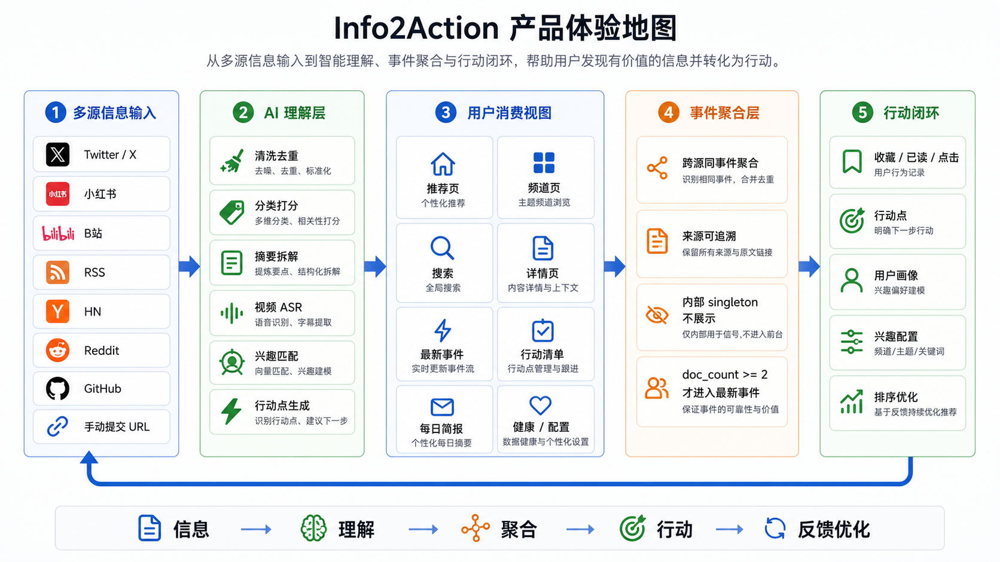

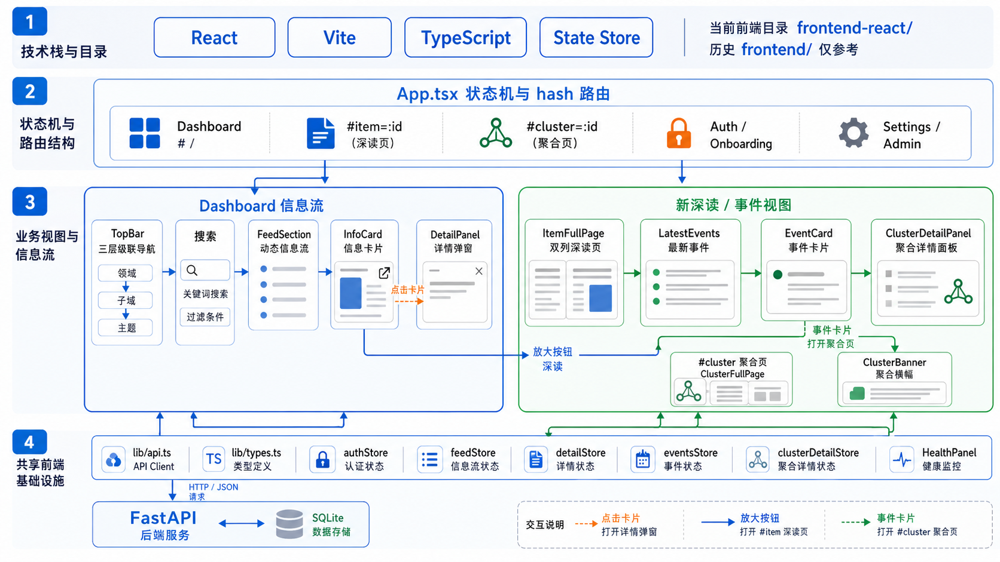

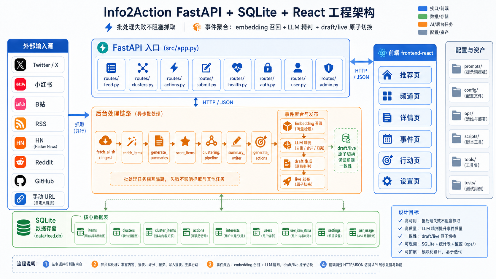

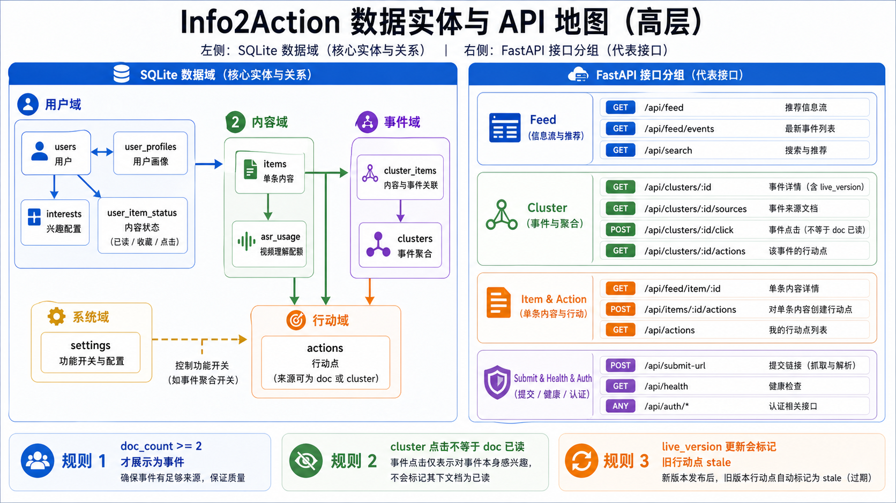

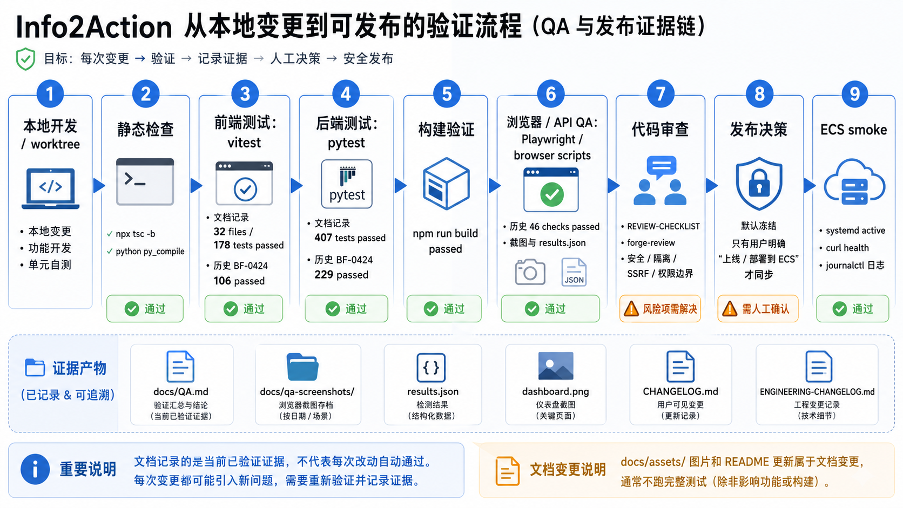

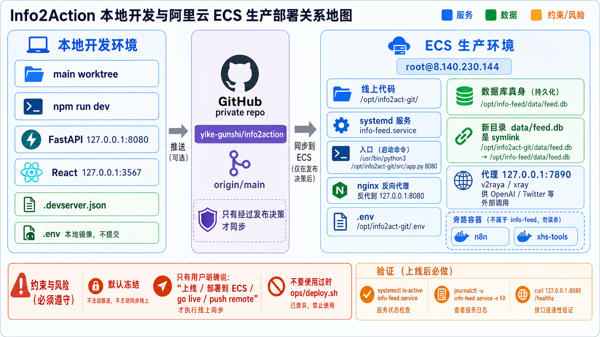

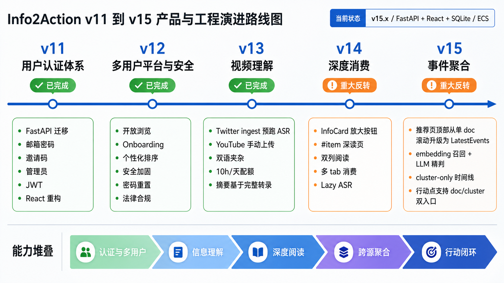

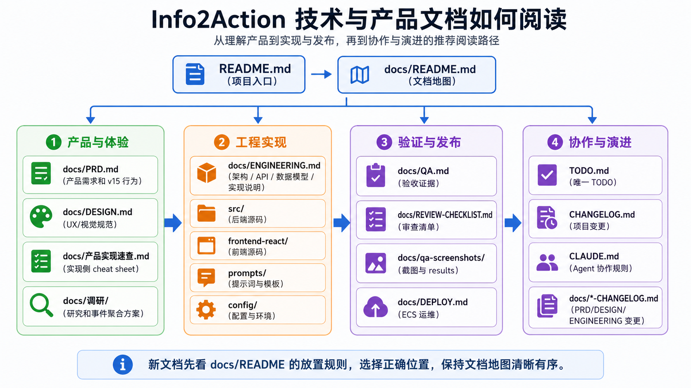

#### 实现速查（调参视角）

每个模块按「输入 → 关键阈值 → Prompt → 可调旋钮 → 已知效果问题」组织，并区分参数来自 config、prompt、Python 硬编码还是 cron：

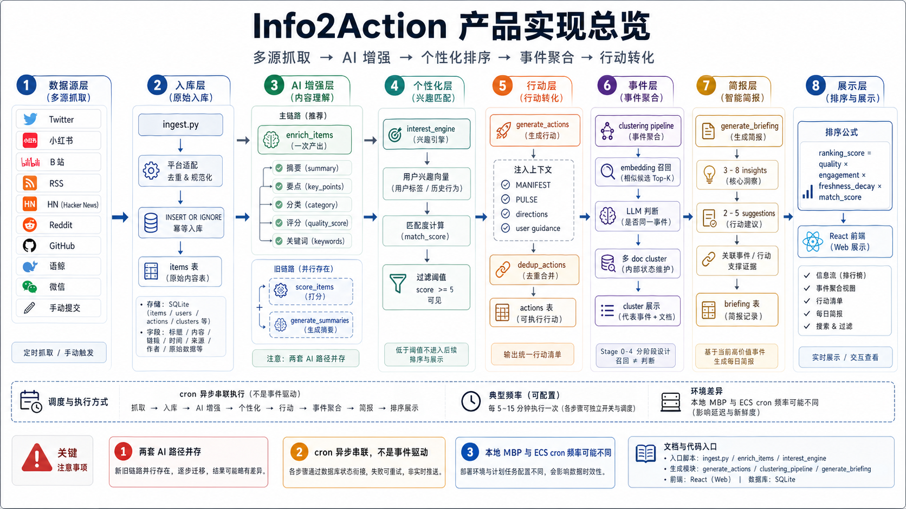

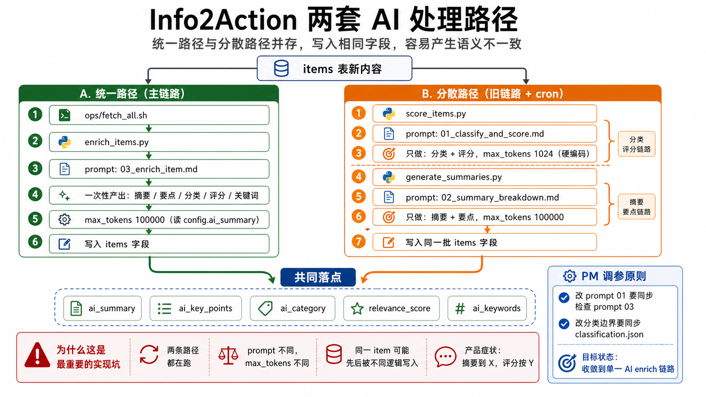

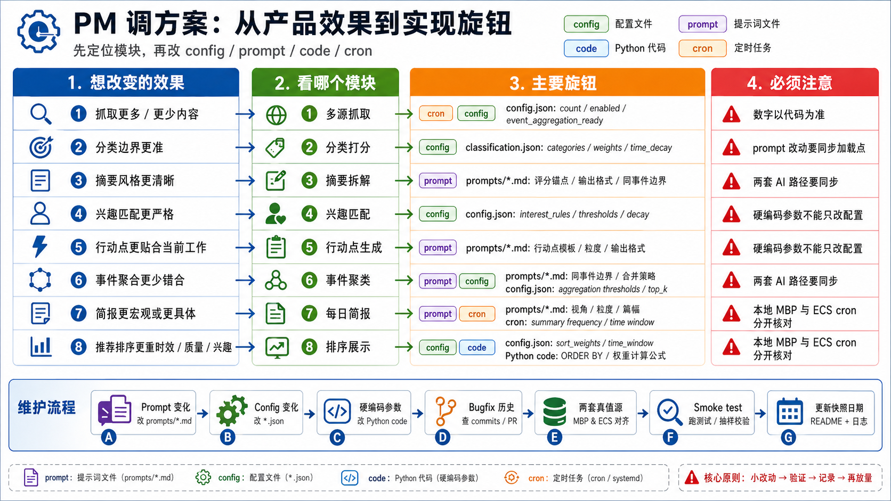

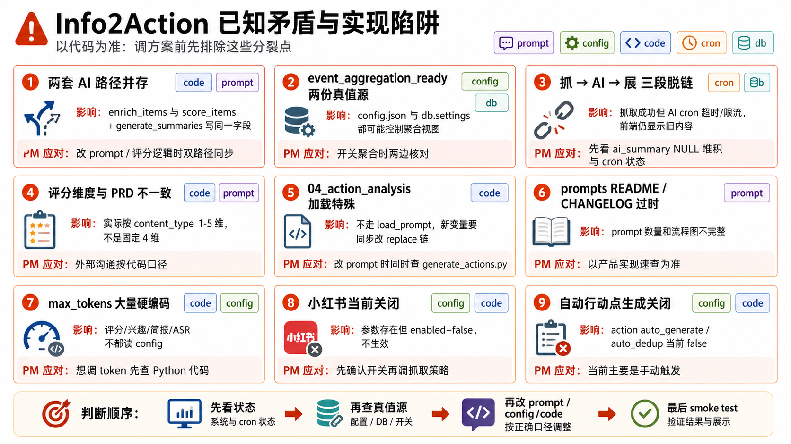

#### 事件聚合设计

核心原则：单 doc 先完成 AI 理解，embedding 只做候选召回，LLM 负责最终同事件判断，内部 singleton 保留但不展示，聚合过程必须可审计。

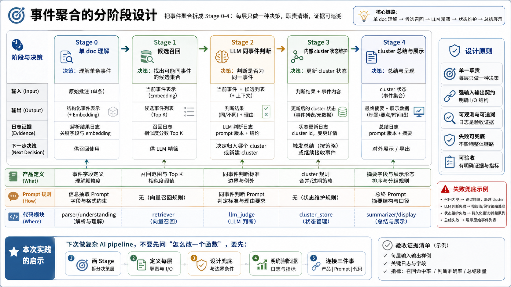

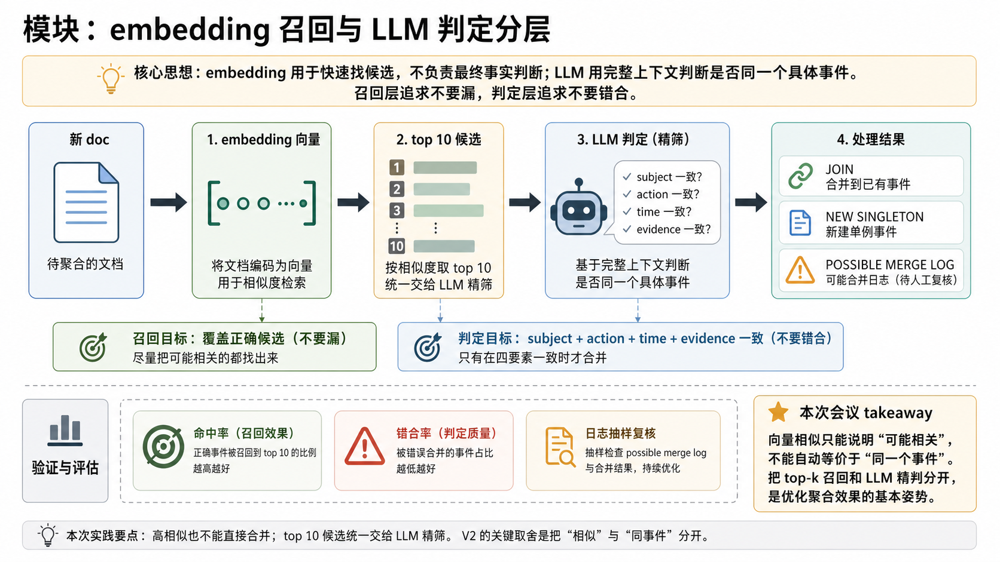

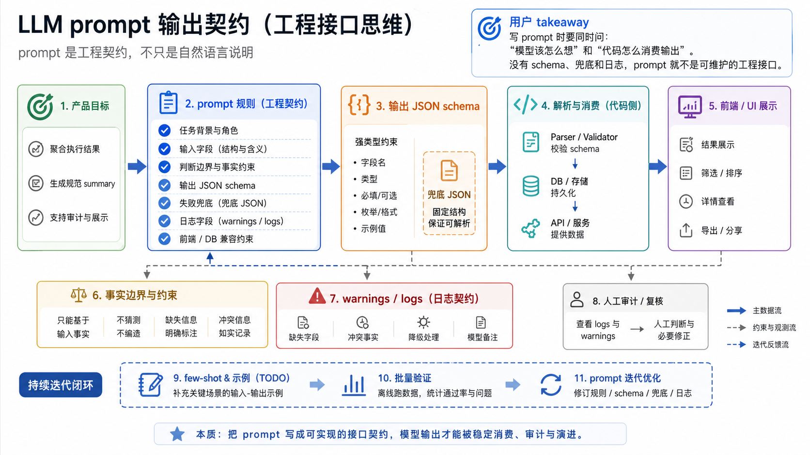

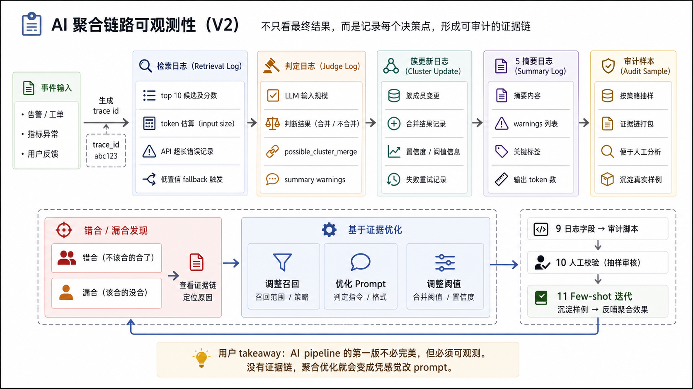

</details>

## 🚀 Quick Start

最小可跑配置：**1 把 LLM key + 默认 RSS 源**，5 分钟体验「信息流 → AI 摘要 → 行动卡」核心闭环。

需要 Twitter / 微信 / Discord / 视频 ASR 等完整能力，请看 [docs/SELF-HOST.md](docs/SELF-HOST.md)。

### 前置

- Python 3.11+
- Node.js 20+
- 1 把 LLM API key（推荐 [MiniMax](https://platform.minimaxi.com/)，国内直连；或豆包 / OpenAI / DeepSeek 任选）

### 步骤

```bash
# 1. clone
git clone https://github.com/yike-gunshi/info2action.git
cd info2action

# 2. 配 .env（最小集）
cp .env.example .env
# 编辑 .env，至少填：
#   MINIMAX_API_KEY=xxx
#   APP_BASE_URL=http://localhost:3567

# 3. 装依赖
uv pip install -r requirements.txt          # 后端
cd frontend-react && npm install && cd ..   # 前端

# 4. 一键启动前后端
npm run dev

# 5. 浏览器打开
open http://127.0.0.1:3567
```

默认端口：后端 `127.0.0.1:8080`，前端 `127.0.0.1:3567`。

第一次启动后跑一次抓取看到数据：

```bash
bash ops/fetch_all.sh    # 拉一轮 RSS + AI 增强（首次约 2-5 分钟）
```

### 常用命令

```bash
npm run dev:status       # 看前后端状态
npm run dev:stop         # 停掉前后端
npm run dev:restart      # 重启

# 测试
npx vitest run --reporter=dot
uv run --with pytest python -m pytest -q
```

<details>
<summary><b>🗄 Supabase 远程数据库模式（进阶，可选）</b></summary>

单机 SQLite 已经是完整体验；要多设备访问同一套数据、或上多用户生产，才需要这一节。

如果只想在新机器/部署环境读取已经同步到 Supabase 的远程数据，可配置：

```bash
SUPABASE_REMOTE_DB_SCHEMA=remote_poc
SUPABASE_DB_URL=postgresql://...
INFO2ACTION_READ_BACKEND=supabase_poc
# 或分别设置:
# INFO2ACTION_FEED_READ_BACKEND=supabase_poc
# INFO2ACTION_EVENT_READ_BACKEND=supabase_poc
# INFO2ACTION_STATUS_BACKEND=supabase_poc
```

服务器部署如果要把 Supabase 作为生产权威数据源，再显式增加：

```bash
INFO2ACTION_DATA_AUTHORITY=supabase
```

这个模式下服务启动会校验 feed / events / status 三个核心 surface 都指向远程数据库，并且 `/api/health` 会使用 Supabase 状态，不再用空本地 SQLite 判断数据健康。

写入侧支持两种模式：

- `sqlite_then_sync`：过渡模式，pipeline 仍先写本机 SQLite，结束后增量同步 Supabase。
- `supabase_direct`：抓取、enrich、embedding、cluster/publish、ASR、feedback、briefing、submit、actions/interests/auth/user-state 直接写 Supabase。必须显式打开各阶段 writer，缺任何一项都会 fail fast。

流水线结束后可以开启远程增量同步（默认关闭，不影响本地 SQLite pipeline）：

```bash
INFO2ACTION_STORAGE_MODE=sqlite_then_sync
INFO2ACTION_PIPELINE_WRITE_MODE=sqlite_then_sync
INFO2ACTION_FETCH_WRITE_BACKEND=supabase
INFO2ACTION_ENRICH_BACKEND=supabase
INFO2ACTION_EMBEDDING_BACKEND=supabase
INFO2ACTION_CLUSTER_BACKEND=supabase
INFO2ACTION_APP_STATE_BACKEND=supabase
INFO2ACTION_REMOTE_SYNC_AFTER_PIPELINE=1
INFO2ACTION_REMOTE_SYNC_HOURS=6
INFO2ACTION_REMOTE_SYNC_MAX_ITEMS=5000
INFO2ACTION_REMOTE_SYNC_MAX_DB_MIB=2048
```

开启后 `ops/fetch_all.sh` 会调用 `ops/remote_sync_after_pipeline.sh`，执行 `--incremental --bulk-copy` 同步最近窗口的完整字段。

直接远程写入模式示例：

```bash
INFO2ACTION_DATA_AUTHORITY=supabase
INFO2ACTION_READ_BACKEND=supabase_poc
INFO2ACTION_PIPELINE_WRITE_MODE=supabase_direct
INFO2ACTION_FETCH_WRITE_BACKEND=supabase
INFO2ACTION_ENRICH_BACKEND=supabase
INFO2ACTION_EMBEDDING_BACKEND=supabase
INFO2ACTION_CLUSTER_BACKEND=supabase
INFO2ACTION_APP_STATE_BACKEND=supabase
INFO2ACTION_ASSET_BACKEND=supabase
SUPABASE_URL=https://PROJECT_REF.supabase.co
SUPABASE_SERVICE_ROLE_KEY=...
SUPABASE_STORAGE_BUCKET=info2action-assets
```

远程 schema 在 [`supabase/migrations/`](supabase/migrations/)，正式建表/迁移优先走 Supabase CLI：

```bash
npx supabase link --project-ref your-project-ref
npx supabase db push --dry-run --linked
npx supabase db push --linked
```

连接分工：应用运行读写使用 session pooler；migration、备份、大批量导入优先使用 direct connection。全量同步前先用 `scripts/preflight_supabase_remote_poc.py` 做容量检查，同步脚本 `scripts/sync_sqlite_to_supabase_poc.py` 也支持写入前门禁。推荐 production / staging 双 Supabase 项目分离，本地调试指向 staging。

</details>

## 📦 Tech Stack

| 类别 | 选型 |
|---|---|
| 后端 | Python 3.11, FastAPI, Uvicorn, SQLite / Supabase Postgres（+pgvector, Storage） |
| 前端 | React 18, Vite, TypeScript, Zustand, Tailwind CSS, shadcn/ui |
| LLM | MiniMax（默认），豆包, OpenAI, DeepSeek（provider 抽象，可切） |
| Embedding | OpenRouter `openai/text-embedding-3-small`（事件聚合召回） |
| 抓取 | Python + 各平台 SDK / 私有 API headers |
| ASR | 豆包 BigModel + OSS 中转 + youtube-transcript-api 字幕优先 |
| 邮件 | Resend |
| 派发 | Discord Forum bot |
| 部署 | 任意 Linux 服务器 + systemd + git 部署 |
| 测试 | pytest, vitest, Playwright |

## 📁 Project Structure

```
src/                FastAPI 后端、抓取、AI 增强、事件聚类、行动生成
frontend-react/     React/Vite 前端（精选 / 信息 / 行动 三 tab）
prompts/            LLM prompt 模板（每个模块一份，可读可改）
config/             非敏感运行配置（源列表、分类、聚类参数）
supabase/           远程数据库 schema migrations
ops/                pipeline 入口（fetch_all / 远程同步）
scripts/            开发与维护工具（dev-stack、Supabase 同步/校验）
workers/            Cloudflare Workers（辅助抓取）
tests/              后端测试
docs/               自部署与配置文档 + 架构图解素材
```

## 🧭 Status & Roadmap

| 模块 | 状态 |
|---|---|
| 多源采集（10+ 平台） | ✅ 稳定 |
| AI 增强 pipeline | ✅ 稳定 |
| 跨源事件聚合 V2 | ✅ 已上线，持续调优 |
| AI 精选（LLM verdict） | ✅ 已上线 |
| 个性化排序 + 兴趣画像 | ✅ 稳定 |
| 多用户（开放浏览 + 邀请注册 + 邮箱验证） | ✅ 已上线 |
| 视频 ASR + 双语字幕 | ✅ 稳定 |
| Supabase 远程生产模式 | ✅ 已上线 |
| 行动生成与派发 | 🚧 交互重构中（后端链路完整） |
| 移动端体验 | 🚧 持续优化 |
| 英文界面 / i18n | ⏳ 规划中 |

**适合 contributor 切入的方向**：

- 新平台适配（Mastodon / Bluesky / 飞书 / Slack）
- 新 LLM provider 适配（Gemini / Qwen / Kimi 等）
- 离线标注集 + embedding 模型横评
- 移动端 PWA 优化
- i18n（当前界面为中文）

## 🤝 Contributing

欢迎 PR。提 issue 之前请先：

1. 跑通 Quick Start 确认基础环境 OK
2. 读上面的 [架构](#-架构) 章节和深度图解了解全貌
3. 复杂改动先开 issue 讨论方向

## 🏠 Self-hosting

完整自部署（含 Twitter / 微信 / Discord / Resend / OSS / 代理 / 服务器部署）见：

- [docs/SELF-HOST.md](docs/SELF-HOST.md) — 凭证清单 + 凭证获取方式 + 部署模式选择 + 故障排查
- [docs/配置指南.md](docs/配置指南.md) — `.env` / `config.json` 字段详解

## 💬 Community

这个项目的另一半在代码之外。如果你也在打理自己的信息流，或者只是想聊聊「读什么、做什么」——欢迎来：

<table>
  <tr>
    <td align="center">
      <br>
      <sub><b>微信公众号</b><br>项目动态 · AI 信息流实践</sub>
    </td>
    <td align="center">
      <br>
      <sub><b>个人微信</b><br>加微信备注 <code>info2act</code>，拉你进群</sub>
    </td>
    <td align="center">
      <br>
      <sub><b>info2act 交流群</b><br>群码 7 天有效，过期加个人微信拉群</sub>
    </td>
  </tr>
</table>

也欢迎直接开 Issue / Discussion 讨论。

## 📄 License

[MIT](LICENSE) © 2025-2026 yike-gunshi

## 🙏 Acknowledgments

- [MiniMax](https://platform.minimaxi.com/) — Embedding + LLM
- [豆包 BigModel](https://www.volcengine.com/product/doubao) — ASR + LLM 备选
- [Resend](https://resend.com/) — 注册邮箱验证
- Forge 工作流 — 项目由 PRD → 设计 → 工程 → QA → ship 的 agent 协作流程推动
- 以及所有被聚合的源平台——信息的上游，永远值得尊重
